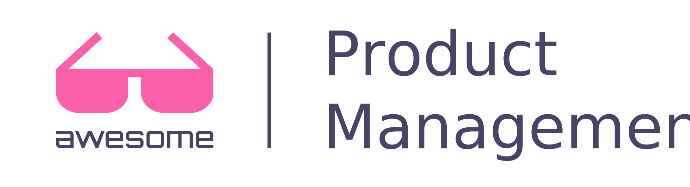

# Awesome Product Management 

A curated list of awesome resources for Product Managers to learn and grow. 

## What is Product Management?

Product Management is an organizational function that guides every step of a product’s lifecycle: from development, to positioning and pricing, by focusing on the product and its customers first and foremost. To build the best possible product, product managers advocate for customers within the organization and make sure the voice of the market is heard and heeded.

Thanks to this focus on the customer, product teams routinely ship better-designed and higher-performing products. In tech, where entrenched products are quickly uprooted by newer and better solutions, there is more need than ever for an intimate understanding of customers and the ability to create tailored solutions for them. That’s where product management comes in.

Definition from Atlassian (https://www.atlassian.com/agile/product-management)

## Contents

- [Skills & Areas of Responsibility](#skills)
  - [Strategy](#strategy)
  - [Execution](#execution)
  - [Soft Skills](#softskills)
- [Frameworks](#frameworks)
- [Courses, Training & Certifications](#courses)
	- [Online](#online)
	- [Classroom](#classroom)
	- [Certifications](#certifications)
- [Resources](#resources)
	- [Articles](#articles)
		- [Adoption](#adoption)
		- [Engagement](#engagement)
		- [Assorted](#assorted)
	- [Blogs](#blogs)
	- [Books](#books)
	- [Newsletters](#newsletters)
	- [People to Follow](#people)
	- [Podcasts](#podcasts)
	- [Videos](#videos)
		- [Talks](#talks)
	- [Tools](#tools)
	  - [To-Do](#to-do)
	  - [Notes](#notes)
	  - [Product Roadmap](#product-roadmap)
	  - [Research](#research)
	  - [Prototyping & Wireframing](#prototyping-wireframing)
- [Conferences](#conferences)
- [Communities](#communities)
- [Meetups](#meetups)
- [License](#license)

                                     
## Skills & Areas of Responsibility

Curated articles on specific areas of Product Management.

### Strategy

- [Intro to Product Strategy](https://medium.com/@gibsonbiddle/intro-to-product-strategy-60bdf72b17e3)

#### Market Problems

- [How do Product Managers conduct user, market or competitive research](https://www.quora.com/How-do-Product-Managers-conduct-user-market-or-competitive-research-i-e-what-tools-or-techniques-do-you-use-and-are-these-things-done-differently-in-big-firms-such-as-Google-as-compared-to-at-startups?share=1)
- [What is Market Research and Competitive Analysis?](https://280group.com/what-is-product-management/skills/market-research-competitive-analysis/)
- [Understand your market problems and validate your solution](https://learn.marsdd.com/article/validating-your-solution-an-overview/)
- [Identifying Customer Pain Points and Validating Ideas](https://www.shopify.com/partners/blog/product-management-basics)
- [Market Validation](https://www.productplan.com/glossary/market-validation/)
- [Validate or Die: Using Validation to Build the Right Product](https://www.mindtheproduct.com/validate-or-die-using-validation-to-build-the-right-product/)

#### Win/Loss Analysis

- [How to do Win Loss Analysis](https://www.crayon.co/blog/how-to-do-win-loss-analysis-examples-resources)
- [How to Conduct Win Loss Analysis](https://openviewpartners.com/blog/how-to-conduct-win-loss-analysis/)
- [Starting and Running a Win Loss Program](https://www.pragmaticinstitute.com/resources/articles/starting-and-running-a-win-loss-program)

#### Competitor Research

- [SWOT Overview](https://medium.com/s/how-to-build-a-brand/lets-talk-about-swot-analysis-a49f825406fa)
- [Marty Cagan](https://svpg.com/competition/)
- [Competitor Matrix](https://www.crayon.co/blog/competitive-matrix-examples)
- [Intercom on Product vs Company Strategy](https://www.intercom.com/blog/podcasts/intercom-on-product-ep07/)
- [JTBD](http://www.extendslogic.com/business/jobs-to-be-done-cancel-interviews/)
- [/r/productmanagement](https://www.reddit.com/r/ProductManagement/comments/9lvmsw/how_do_you_gather_detailed_competitor_intelligence/)
- [UX Studio](https://uxstudioteam.com/ux-blog/competitor-analysis/)
- [Airtable](https://airtable.news/a-step-by-step-guide-to-running-competitor-analysis-774b917faf41)
- [UX Design](https://uxdesign.cc/keep-agile-teams-aligned-820fdf142a60)
- [PM Insider](https://medium.com/pminsider/real-competitive-analysis-is-about-learning-to-love-your-competitor-15e45b9ef10a)

#### Market Definition

- [What is Market Segmentation?](https://280group.com/what-is-product-management/skills/market-segmentation/)
- [AI meets marketing segmentation models](https://towardsdatascience.com/data-science-powered-segmentation-models-ae89f9bd405f)
- [The 6 types of user segmentation and what they mean for your product](https://uxdesign.cc/how-to-think-segmentation-from-day-1-f714df093ccb)
- [Market Segmentation Through A Jobs-to-be-Done Lens](https://jobs-to-be-done.com/market-segmentation-through-a-jobs-to-be-done-lens-5ef9242de65)

#### Distribution Strategy

- 
- 
- 

#### Product Portfolio

- [What is Product portfolio?](https://www.marketing91.com/product-portfolio/)
- 
- 

#### Product Roadmap

- [Magical Thinking and the Zero-Sum Roadmap](https://www.mironov.com/magical_thinking/)
- [Drop Feature-based Product Roadmaps](https://www.producttalk.org/2014/04/drop-feature-based-product-roadmaps/)
- [Before you Plan your Product Roadmap](https://www.intercom.com/blog/before-you-plan-your-product-roadmap/)
- [What does an Agile Product Roadmap Look Like?](https://medium.com/@jboogie/what-does-an-agile-product-roadmap-look-like-cf0dbe5be4ef)
- [The Art of the Strategic Product Roadmap](https://productcoalition.com/the-art-of-the-strategic-product-roadmap-c881f261b4eb)

#### Business Plan

- 
- 
- 

#### Pricing

- [What are Product Pricing Strategies?](https://280group.com/what-is-product-management/skills/product-pricing-strategies/)
- [Why the Product Team Must Own Pricing](https://www.pragmaticinstitute.com/resources/articles/why-the-product-team-must-own-pricing)
- [A Founder’s Guide to Product Pricing](https://medium.com/dreamit-perspectives/founders-guide-to-product-pricing-b187093e2483)
- [My Product Management Toolkit (28): Testing Price Sensitivity](https://medium.com/@maa1/my-product-management-toolkit-28-testing-price-sensitivity-4d3679a3e8e7)
- [How Should I Price My Product?](https://www.aha.io/roadmapping/guide/product-strategy/how-should-i-price-my-product)

#### Buy, Build or Partner

- [Buy vs. build: Six steps to making the right decision](https://www.techrepublic.com/article/buy-vs-build-six-steps-to-making-the-right-decision/)
- [When It Comes to Software, Should You Build or Buy?](https://medium.com/@ginatrapani/when-it-comes-to-software-should-you-build-or-buy-f30b2e6511d6)
- [As a software product manager, when and how do you make build vs. buy decision?](https://www.quora.com/As-a-software-product-manager-when-and-how-do-you-make-build-vs-buy-decision?share=1)

#### Product Profitability

- 
- 
- 

#### Innovation

- 
- 
- 

#### Positioning

- 
- 
- 

#### Buyer Experience

- 
- 
- 

#### Buyer Personas

- 
- 
- 

#### User Personas

- 
- 
- 

#### Requirements

- 
- 
- 

#### Use Scenarios

- 
- 
- 

#### Stakeholder Communications

- 
- 
- 

### Execution

#### Go-to-Market Team

- 
- 
- 

#### Product Launch Plan

- 
- 
- 
- 

#### Marketing Plan

- 
- 
- 

#### Revenue Growth

- 
- 
- 

#### Revenue Retention

- 
- 
- 

#### Launch

- 
- 
- 

#### Awareness

- 
- 
- 

#### Nurturing

- 
- 
- 

#### Advocacy

- 
- 
- 

#### Measurement

- [HEART Framework](https://www.interaction-design.org/literature/article/google-s-heart-framework-for-measuring-ux)
- [Measure twice, cut once](https://library.gv.com/measure-twice-cut-once-e86c2f08b4c)
- [The Only Metric That Matters](https://medium.com/@joshelman/the-only-metric-that-matters-ab24a585b5ea)

#### Sales Alignment

- 
- 
- 

#### Content

- 
- 
- 

#### Sales Tools

- 
- 
- 

#### Channel Training

- 
- 
- 

#### Programs

- 
- 
- 

#### Operations

- 
- 
- 

#### Events

- 
- 
- 

#### Channels

- 
- 
- 

### Documents & Plans

#### Business Case Document

- 
- 
- 

#### Market Needs Document

- 
- 
- 

#### Product Description Document

- [Newbie PM’s Guide to the Product Requirements Document](https://medium.com/@joellefungyh/newbie-pms-guide-to-the-product-requirements-document-61f7776ab3f1)
- 
- 

#### Roadmap Document

- [How we Build Product Roadmap at Asana](https://medium.com/@jackiebo/how-we-build-our-product-roadmap-at-asana-56953b1e25ad)
- [Using Themes in your Modern PM Roadmap](https://medium.com/@jonatisokon/using-themes-in-your-modern-product-management-roadmap-d6fb064df266)
- [StopProduct Roadmaps](https://medium.com/@johnpcutler/stop-setting-up-product-roadmaps-to-fail-3189452360a3)

#### Market Strategy Document

- 
- 
- 

#### Beta Plan

- 
- 
- 

#### Launch Plan

- [Product Launch Plan](https://www.productplan.com/product-launch-plan/)
- 
- 

#### Marketing Plan

- 
- 
- 

#### End of Life Plan

- [How to End of Life a Product](https://www.productplan.com/how-to-end-of-life-product/)
- [End of Life Product](https://280group.com/what-is-product-management/documents-templates/end-of-life-product-eol/)
- 

## Soft Skills

### Empathy

- [Empathy Map Canvas](https://medium.com/the-xplane-collection/updated-empathy-map-canvas-46df22df3c8a)
- [How to Run an Empathy & User Journey Mapping Workshop](https://medium.com/@harrybr/how-to-run-an-empathy-user-journey-mapping-workshop-813f3737067)
- [Journey Mapping is Key to Gaining Empathy](https://uxplanet.org/journey-mapping-is-key-to-gaining-empathy-1da5b54655e1)
- [Empathy: One of The Keys to My Business Success](https://medium.com/@garyvee/empathy-one-of-the-keys-to-my-business-success-25fb418e5a81)
- [User Research. Empathy Is the Best UX Policy.](https://uxplanet.org/user-research-empathy-is-the-best-ux-policy-5f966ba5bbdc)

### Communication

- [On the importance of writing for Product Managers](https://medium.com/@opj.duprat/on-the-importance-of-writing-for-product-managers-23ead50055ca)
- [Write to Influence: Effective Writing with Pyramid Principle](https://medium.com/@young_elva/%EF%B8%8Fhow-to-influence-pyramid-principle-in-product-management-e1adc0436899)
- [Product Manager Leadership: How to create communications in the company](https://medium.com/mytake/product-managers-leadership-how-to-build-communications-283724aafd4b)

### Multi-tasking

- [The Cost of Context Switching](https://medium.com/@michaelcalleia/the-cost-of-context-switching-909f1d1569a1)
- [Dealing with Context Switching as a Product Manager](https://medium.com/everyone-is-a-product-expert/dealing-with-context-switching-as-a-product-manager-8ae1971ca0c2)
- [The Price We Pay for Multitasking at Work](https://medium.com/s/please-advise/my-eyes-are-up-here-5f6eba6a4d1e)
- [Multitasking is Killing Your Brain](https://medium.com/the-mission/multitasking-is-killing-your-brain-79104e62e930)

### Problem-solving

- [The 4 Most Effective Ways Leaders Solve Problems](https://www.forbes.com/sites/glennllopis/2013/11/04/the-4-most-effective-ways-leaders-solve-problems/#2d03b9fe4f97)
- [What is Problem Solving?](https://asq.org/quality-resources/problem-solving)
- [Level Up Your Problem-Solving Skills](https://www.producttalk.org/2016/01/product-managers-level-problem-solving-skills/)
- [Problem Solving for Product Managers](https://uxdesign.cc/the-discipline-of-problem-solving-for-product-managers-1e93e84f3a29)

## Frameworks

- [Open Product Management Workflow™](https://open-pmw.org/)
- [Pragmatic Framework](https://www.pragmaticinstitute.com/framework) - Pragmatic Institute have created their own product management framework that they teach via in-person or online training.
- [Optimal Product Process™](https://280group.com/product-management-methodology/optimal-product-process-framework/)
- [Best Practicer](https://bestpracticer.com/topic/product-management)

## Courses, Training & Certifications

### Online

- [Udemy - Become a Product Manager](https://www.udemy.com/course/become-a-product-manager-learn-the-skills-get-a-job/)
- [Udemy - Product Management 101](https://www.udemy.com/course/productmanagement101/)
- [Udemy - Master the Product Manager Interview](https://www.udemy.com/course/productmanagementinterview/)
- [Udemy - Advanced Product Management: Vision, Strategy & Metrics](https://www.udemy.com/course/advanced-product-management-vision-strategy-metrics/)
- [Udacity - Become a Product Manager](https://www.udacity.com/course/product-manager-nanodegree--nd036)
- [CPM - Online Course & Exam](https://280group.com/products/online-courses/certified-product-manager-online-course-exam/) - The Certified Product Manager – Online Course and Exam teaches you all the core skills that are critical to be a highly-effective Product Manager. In this course you’ll learn how to manage products through every phase of the Product Lifecycle to make them (and your career) more successful. The online course includes 18 learning modules, quizzes, interactive exercises, study materials and a comprehensive practice exam to help you master the material and pass the worldwide-standard Certified Product Manager exam.

### Classroom

- [Product School](https://www.productschool.com/)

### Certifications

- [CPM - Certified Product Manager](https://aipmm.com/cpm/) - The Association of International Product Marketing & Management offers the CPM certification by way of an exam.

## Resources

### Articles

#### Adoption

- [The Complete Guide to Product Adoption: from Product Life Cycle to Customer Decision Journey](https://flevy.com/blog/the-complete-guide-to-product-adoption-from-product-lifecycle-to-customer-decision-journey/)
- [Understanding The Product Adoption Curve Could Totally Transform Your SaaS Marketing](https://www.crazyegg.com/blog/product-adoption-to-transform-marketing/)
- [Product adoption: how to get customers to embrace your product](https://www.intercom.com/blog/product-adoption/)
- [The 10 Principles of Product & Feature Adoption](https://medium.com/@_pulkitagrawal/the-10-principles-of-product-feature-adoption-68907634446f)

#### Engagement

- [Product engagement: the most important metric you aren’t tracking for your SaaS business](https://www.intercom.com/blog/product-engagement/)
- [To improve product engagement, think outside of the product](https://www.appcues.com/blog/improve-product-engagement-think-outside-of-the-product)
- [How to Create Sustainable Product Engagement](https://medium.com/better-product/how-to-create-sustainable-product-engagement-2ab88debecb6)

#### Assorted
- [Want To Build An Incredible Product? Strive For The Delta Of “Wow”](https://blog.usejournal.com/want-to-build-an-incredible-product-strive-for-the-delta-of-wow-f184b716af18) - By [Wayne Chang](https://twitter.com/Wayne).
- [The Quintessential Guide For Building An Unforgettable First-time User Experience](https://hackernoon.com/the-quintessential-guide-for-building-an-unforgettable-first-time-user-experience-19720a7447d2) - By [Wayne Chang](https://twitter.com/Wayne).
- [One door at a time](https://m.signalvnoise.com/one-door-at-a-time/) - By [Jason Fried](https://twitter.com/jasonfried).
- [Good Product Manager/Bad Product Manager](https://a16z.com/2012/06/15/good-product-managerbad-product-manager/) - By [Ben Horowitz](https://twitter.com/bhorowitz).
- [Guide to Career Planning](https://pmarchive.com/guide_to_career_planning_part0.html) - By [Marc Andresssen](https://twitter.com/pmarca).
- [Guide to Personal Productivity](https://pmarchive.com/guide_to_personal_productivity.html) - By [Marc Andresssen](https://twitter.com/pmarca).
- [PM at Microsoft](https://blogs.msdn.microsoft.com/techtalk/2005/12/16/pm-at-microsoft/) - By [Steven Sinofsky](https://twitter.com/stevesi).
- [Hiring Your First Product Manager](https://blog.learningbyshipping.com/2015/04/07/hiring-your-first-product-manager/) - By [Steven Sinofsky](https://twitter.com/stevesi).
- [12 Things about Product-Market Fit](https://a16z.com/2017/02/18/12-things-about-product-market-fit/) - By [Tren Griffin](https://twitter.com/trengriffin).
- [Relentlessly Resourcefull](http://www.paulgraham.com/relres.html) - By [Paul Graham](https://twitter.com/paulg).
- [How to Be an Expert in a Changing World](http://www.paulgraham.com/ecw.html) - By [Paul Graham](https://twitter.com/paulg).
- [The Time Value of Shipping](https://blackboxofpm.com/the-time-value-of-shipping-6deaf8d7d565) - By [Brandon Chu](https://twitter.com/brandonmchu).
- [Maker's Schedule, Manager's Schedule](http://www.paulgraham.com/makersschedule.html) - By [Paul Graham](https://twitter.com/paulg).
- [Deadlines](https://blackboxofpm.com/deadlines-d6925e5c694f) - By [Brandon Chu](https://twitter.com/brandonmchu).
- [Ruthless Prioritization](https://blackboxofpm.com/ruthless-prioritization-e4256e3520a9) - By [Brandon Chu](https://twitter.com/brandonmchu).
- [Understanding How The Innovator’s Dilemma Affects You](https://bothsidesofthetable.com/understanding-how-the-innovator-s-dilemma-affects-you-75563219a58d) - By [Mark Suster](https://twitter.com/msuster).
- [Do Things that Don't Scale](http://paulgraham.com/ds.html) - By [Paul Graham](https://twitter.com/paulg).
- [Navigating Mid-Success](https://blog.ycombinator.com/navigating-mid-success/) - By [Sam Altman](https://twitter.com/sama).
- [How to focus on what's important, not just what's urgent](https://hbr.org/2018/07/how-to-focus-on-whats-important-not-just-whats-urgent) - By [Alice Boyes](https://twitter.com/draliceboyes).
- [Speed as a habit](http://firstround.com/review/speed-as-a-habit/) - By [Dave Girouard](https://www.linkedin.com/in/davegirouard).
- [A Comprehensive Guide To Product Design](https://www.smashingmagazine.com/2018/01/comprehensive-guide-product-design/) - By [Nick Babich](https://www.smashingmagazine.com/author/nickbabich).
- [Coaching Tools – The Plan](https://svpg.com/coaching-tools-the-plan/) - By [Marty Cagan](https://svpg.com/author/marty/).
- [The dark side of expertise](https://lwn.net/Articles/809556/) - By Jake Edge.
- [Remote teams](https://www.notion.so/Remote-teams-5ca3f257580040718fde6eb25c47e134) - By Notion Team.
- [On narratives](https://ceklog.kindel.com/?s=narratives) - By [Charlie Kindel](https://twitter.com/ckindel).
- [3 Skillsets for PM Success](http://blog.kentonkivestu.com/3-skillsets-for-PM-success)
- [What Distinguishes the Top 1% of Product Managers from the Top 10%?](https://www.quora.com/Product-Management/What-distinguishes-the-Top-1-of-product-managers-from-the-Top-10)

### Blogs

- [Stratechery by Ben Thompson](https://stratechery.com/) - Product and strategy insights from the industry.

### Books

- [Switch: How to Change Things When Change Is Hard](https://www.amazon.com/Switch-Change-Things-When-Hard/dp/0385528752) - By Chip Heath and Dan Heath.
- [Made to Stick: Why Some Ideas Survive and Others Die](https://www.amazon.com/Made-Stick-Ideas-Survive-Others/dp/1400064287) - By Chip Heath and Dan Heath.
- [The Startup Owner's Manual: The Step-By-Step Guide for Building a Great Company](https://www.amazon.com/Startup-Owners-Manual-Step-Step/dp/0984999302) - By Steve Blank and Bob Dorf.
- [Business Model Generation: A Handbook for Visionaries, Game Changers, and Challengers](https://www.amazon.com/Business-Model-Generation-Visionaries-Challengers/dp/0470876417) - By Alexander Osterwalder and Yves Pigneur.
- [Value Proposition Design: How to Create Products and Services Customers Want (Strategyzer)](https://www.amazon.com/Value-Proposition-Design-Customers-Strategyzer/dp/1118968050) - By Alexander Osterwalder and Yves Pigneur.
- [The Lean Startup: How Today's Entrepreneurs Use Continuous Innovation to Create Radically Successful Businesses](https://www.amazon.com/Lean-Startup-Entrepreneurs-Continuous-Innovation/dp/0307887898) - By Eric Ries.
- [The Hard Thing About Hard Things: Building a Business When There Are No Easy Answers](https://www.amazon.com/Hard-Thing-About-Things-Building/dp/0062273205) - By Ben Horowitz.
- [The Four Steps to the Epiphany](https://www.amazon.com/Four-Steps-Epiphany-Steve-Blank/dp/0989200507) - By Steve Blank.
- [The Innovator's Dilemma: When New Technologies Cause Great Firms to Fail (Management of Innovation and Change)](https://www.amazon.com/Innovators-Dilemma-Technologies-Management-Innovation/dp/1633691780) - By Clayton M. Christensen.
- [Hooked: How to Build Habit-Forming Products](https://www.amazon.com/Hooked-How-Build-Habit-Forming-Products/dp/1591847788) - By Nir Eyal.
- [The Lean Product Playbook: How to Innovate with Minimum Viable Products and Rapid Customer Feedback](https://www.amazon.com/Lean-Product-Playbook-Innovate-Products/dp/1118960874) - By Dan Olsen.
- [Creativity, Inc.: Overcoming the Unseen Forces That Stand in the Way of True Inspiration](https://www.amazon.com/Creativity-Inc-Overcoming-Unseen-Inspiration/dp/0812993012) - By Ed Catmull and Amy Wallace.
- [Measure What Matters: How Google, Bono, and the Gates Foundation Rock the World with OKRs](https://www.amazon.com/Measure-What-Matters-Google-Foundation/dp/0525536221) - By John Doerr.
- [The Design of Everyday Things: Revised and Expanded Edition](https://www.amazon.com/Design-Everyday-Things-Revised-Expanded/dp/0465050654) - By Don Norman.
- [Radical Candor: Be a Kick-Ass Boss Without Losing Your Humanity](https://www.amazon.com/Radical-Candor-Kickass-Without-Humanity/dp/1250103509) - By Kim Scott.
- [Sprint: How to Solve Big Problems and Test New Ideas in Just Five Days](https://www.amazon.com/Sprint-Solve-Problems-Test-Ideas/dp/150112174X/) - By Jake Knapp, John Zeratsky, Braden Kowitz.
- [Creative Selection](http://creativeselection.io/) - By Ken Kocienda.
- [Inspired: How to Create Tech Products Customers Love](https://www.amazon.com/INSPIRED-Create-Tech-Products-Customers/dp/1119387507) - By Marty Cagan.

### People to Follow

- [Ken Norton](https://twitter.com/kennethn) - Partner @GVTeam. Formerly PM @Google.
- [Josh Elman](https://twitter.com/joshelman) - Partner, @GreylockVC: @Medium, @Jelly, @AppMeerkat, @Operator, @discordapp @Nextdoor.
- [Hunter Walk](https://twitter.com/hunterwalk) - @homebrew, Seed Stage Venture Fund w @satyap. Made products at YouTube, Google & SecondLife.
- [Ian McAllister](https://twitter.com/ianmcall) - Director of Product at Airbnb. Former Amazon and founder of @AmazonSmile.
- [Marty Cagan](https://twitter.com/cagan) - I'm a partner at Silicon Valley Product Group, specializing in product teams and product strategy
- [Ellen Chisa](https://twitter.com/ellenchisa) - VP Product for http://lolatravel.com , temporary @harvardhbs dropout.
- [Jackie Bavaro](https://twitter.com/jackiebo) - Asana Product Manager. Co-Author of Cracking the PM Interview. Previously @ Google & Microsoft
- [Fernando Delgado](https://www.linkedin.com/in/fernandodelgado/) - Sr. Product Manager at Google. Previously worked as an Entrepreneur, Product Management Coach, and Sr Director of Product Management at Yahoo.
- [Julie Zhuo](https://twitter.com/joulee) - Product design VP @ Facebook.
- [Joel Spolsky](https://twitter.com/spolsky) - CEO of Stack Overflow, co-founder of Fog Creek Software (FogBugz, Kiln), and creator of Trello.
- [Bruce McCarthy](https://twitter.com/d8a_driven) - Innovator, consultant, coach, and evangelist for better products and product development
- [Des Traynor](https://twitter.com/destraynor) - Co-founder of @intercom.
- [Sachin Rekhi](https://twitter.com/sachinrekhi) - Entrepreneur, Product Guy, and Software Engineer.  
- [Adam Nash](https://twitter.com/adamnash) - CEO @Wealthfront
- [Rich Mironov](https://twitter.com/RichMironov) - Tech start-up veteran, product exec/coach/mentor, writer (Art of Product Management)
- [Eric Ries](https://twitter.com/ericries) - Trying to change how startups are built.
- [Steven Sinofsky](https://twitter.com/stevesi) - Board Partner @a16z • Adviser @BoxHQ • Writings @ Learning by Shipping
- [Janna Bastow](https://twitter.com/simplybastow) - Co-Founder of MTP/CEO at ProdPad/CoFounder ProductTank and ProductCamp London
- [Martin Eriksson](https://twitter.com/bfgmartin) - Co-Founder at MTP/ProductTank
- [Simon Cast](https://twitter.com/simoncast) - Co Founder MTP/ProductTank/ProdPad
- [Charunethran Panchalam Govindarajan](https://twitter.com/charupg) - Product Manager, Intel / Social Entrepreneur / Tech Enthusiast 

### Podcasts

| Podcast                                                                             | Hosts        | URL                                                                       | Description |
|-------------------------------------------------------------------------------------|--------------|---------------------------------------------------------------------------|-------------|
|  | Reid Hoffman | https://mastersofscale.com/                                               | How do companies grow from zero to a gazillion? Legendary Silicon Valley investor / entrepreneur Reid Hoffman tests his theories with famous founders. Guests include Facebook’s Mark Zuckerberg & Sheryl Sandberg, Netflix’s Reed Hastings, Google’s Eric Schmidt, Spanx’s Sara Blakely. With original music and hilariously honest stories, the show sounds like nothing you’ve ever heard. |
|         | Multiple     | https://itunes.apple.com/us/podcast/the-product-podcast/id1219400787?mt=2 | This is your Product Management podcast featuring PMs from Google, Facebook, LinkedIn, Spotify, Twitter and other tech companies/ startups. Tune in if you’re a manager, designer, engineer, entrepreneur or marketer who wants to learn the latest best practices. |
|                    | Multiple     | https://www.gimletmedia.com/startup                                       | The business origin story you never get to hear. |
|        | Guy Raz      | https://www.npr.org/podcasts/510313/how-i-built-this                      | Guy Raz dives into the stories behind some of the world’s best known companies. How I Built This weaves a narrative journey about innovators, entrepreneurs and idealists—and the movements they built. |
|                    | Multiple     | https://www.gimletmedia.com/the-pitch                                     | Where real entrepreneurs pitch to real investors—for real money. |
|                       | Multiple     | https://rework.fm/                                                        | A podcast by Basecamp about the better way to work and run your business. We bring you stories and unconventional wisdom from Basecamp’s co-founders and other business owners. |

### Videos & Talks

- [Product Lessons Learned Conference](https://www.producthood.com/pllconf/) - March 16-22th, 2020

### Tools

#### To-Do

- [To-Do](https://to-do.microsoft.com)
- [Trello](https://trello.com)
- [Taskade](https://www.taskade.com) 

#### Notes

- [OneNote](https://onenote.com)
- [Bear](http://www.shinyfrog.net)
- [Notion](https://notion.so)
- [Notejoy](https://notejoy.com)

#### Product Roadmap

- [Product Board](https://www.productboard.com) 

#### Research

#### Prototyping & Wireframing

- [Balsamiq](https://balsamiq.com)
- [Sketch](https://www.sketchapp.com)
- [Figma](https://www.figma.com)
- [InVision](https://www.invisionapp.com/)
- [AdobeXD](https://adobe.com/xd)
- [Maze](https://maze.design/)

## Conferences

- [Industry](https://industryconference.com/)
- [ProductCon](https://www.productschool.com/productcon/)
- [Mind the Product Conference](http://mtpcon.com/sf/) - The Conference for Passionate Product People
- [Lean Startup Week](http://leanstartup.co/2016-conference/) - Lean Startup Week is a seven-day immersion into Lean Startup methodology led by star practitioners in big companies and hot startups from around the world.
- [Enterprise UX 2016](http://2016.enterpriseux.net) - The Enterprise UX 2016 conference is dedicated to delivering useful, delightful, and humane experiences to people who work for and in enterprises.
- [Product Camp Brasil](http://www.productcamp.com.br) - The event is now the largest on Product Management in Latin America, where Brazilian and international speakers share their learnings about Product, UX and Growth with the participants.

## Communities

- [Women in Product](https://www.womenpm.org/) (_using [Facebook](https://facebook.com)_)
- [Product School](https://www.productschool.com/) (_using [Slack](https://slack.com/)_)
- [PMTrack](https://pmtrack.co) (_using [Slack](https://slack.com/)_)
- [The Product Coalition](https://productcoalition.com/) (_using [Slack](https://slack.com/)_)
- [Product Collective](https://productcollective.com/) (_using [Slack](https://slack.com/)_)
- [Reddit - /r/productmanagement](https://www.reddit.com/r/ProductManagement/)
- [Mind the Product](http://www.mindtheproduct.com) - Mind the Product Community Website and Blog
- [Designer Chat](https://www.producthunt.com/r/85601ad255/3697) - The Designer News community in a private Slack chat.
- [Product Manager HQ](https://www.productmanagerhq.com/join-the-community/) - Product Manager HQ - Slack group
- [Product Camp](http://www.productcamp.org) - Product Camp Community Website and Blog

## Meetups

#### North America
- [Product Tank](http://www.meetup.com/producttanknyc/) - Product Tank NY Meetups
- [Product Austin](http://www.meetup.com/ProductAustin/) - The largest Product Meet-up in Austin, TX
- [The Product Group](http://www.meetup.com/TheProductGroup/) - The Product Group New York
- [Lean Product & Lean UX Silicon Valley](http://www.meetup.com/lean-product/) - People interested in applying Lean Startup, Lean UX, and Agile principles to design and develop products that customers love
- [Product Management Fast Track](http://www.meetup.com/ProductManagementFastTrack/) - Product Management in San Francisco
- [SUPA Product Talks SFBay](http://www.meetup.com/SUPAProductTalks/) - SUPA Product Academy in San Francisco
- [Silicon Valley Strategy, Innovation and Product Management](http://www.meetup.com/Silicon-Valley-Product-Management/) - Product Management in Cupertino, CA
- [Startup Metrics Toronto, Canada](http://www.meetup.com/Startup-Metrics-Toronto/) - A group for entrepreneurs and product managers to discuss the metrics that matter to their startups.
- [Product School - San Francisco Meetup](http://www.meetup.com/productmanagementSF/) - Product School Meetup
- [Product School - Silicon Valley Meetup](http://www.meetup.com/productmanagementSV/) - Product School Meetup
- [Product School - New York Meetup](http://www.meetup.com/productmanagementNY/) - Product School Meetup
- [Product School - Los Angeles Meetup](http://www.meetup.com/productmanagementLA/) - Product School Meetup
- [Product School - Boston Meetup](http://www.meetup.com/productmanagementBOS/) - Product School Meetup

#### Europe
- [The Product Group London](http://www.meetup.com/TheProductGroupLondon/) - The Product Group London
- [ProductTank](https://www.mindtheproduct.com/producttank/)

#### Asia
- [Product Management Singapore Facebook](https://www.facebook.com/groups/prodmgmtsg/) - Product Management SG Community
- [Product Camp - Singapore Meetup](http://www.meetup.com/Product-Camp-Singapore/) - Product Camp Meetup
- [Product Hunt - Singapore Meetup](http://www.meetup.com/Product-Hunt-Singapore-Meetup-Group/) - Product Hunt Meetup
- [Product Talks - Singapore Meetup](http://www.meetup.com/producttalkssingapore/) - Product Talks Meetup
- [Product Tank - Singapore Meetup](http://www.meetup.com/ProductTank-Singapore/) - Product Tank Meetup
 

#### South America
- [Produto.io - São Paulo](https://www.meetup.com/produto-io-sp/) - Produto.io Meetup in São Paulo
- [Product School - Belo Horizonte](http://www.meetup.com/product-school-belohorizonte/) - Product School Meetup

## Jobs

- [Mind The Product](https://jobs.mindtheproduct.com/)
- [Product Hired](https://producthired.com/)
- [PathToProduct](https://www.pathtoproduct.com/)
- [WeWorkRemotely](https://weworkremotely.com/categories/remote-product-jobs)

## Preparation

- [Product Management Exercises](https://www.productmanagementexercises.com/)

## Career & Professional Development

### Career Paths
- [PM Career Ladders at 8 Top Tech Firms](https://www.sachinrekhi.com/product-management-career-ladders-at-8-top-technology-firms)
- [PM Skills by Seniority Level](https://medium.com/pminsider/product-manager-skills-by-seniority-level-a-deep-breakdown-cd0690f76d10)
- [PM Career Path](https://mixpanel.com/blog/2016/07/28/hunter-walk-product-manager-career-path/)
- [PM Careers Levels, Growth and Promotions](https://medium.com/pminsider/product-management-careers-levels-career-growth-and-promotions-13f93a383a5a)
- [Evolving Your PM Career Ladder](https://www.intercom.com/blog/evolving-your-product-management-career-ladder/)

### Building Your Resume

- [Building Your PM Brand](https://blog.usejournal.com/building-your-product-manager-brand-and-why-it-matters-94dd867e2c00)
- [How to build your “portfolio” as a product manager](https://productcoalition.com/how-to-build-a-portfolio-as-a-product-manager-8d1c8791bd60)
- [Professional Development as a PM](https://productmanagerhq.com/professional-development-as-a-product-manager/)

### Salary Guides

## License

Licensed under the [Creative Commons CC0 License](https://creativecommons.org/publicdomain/zero/1.0/).
